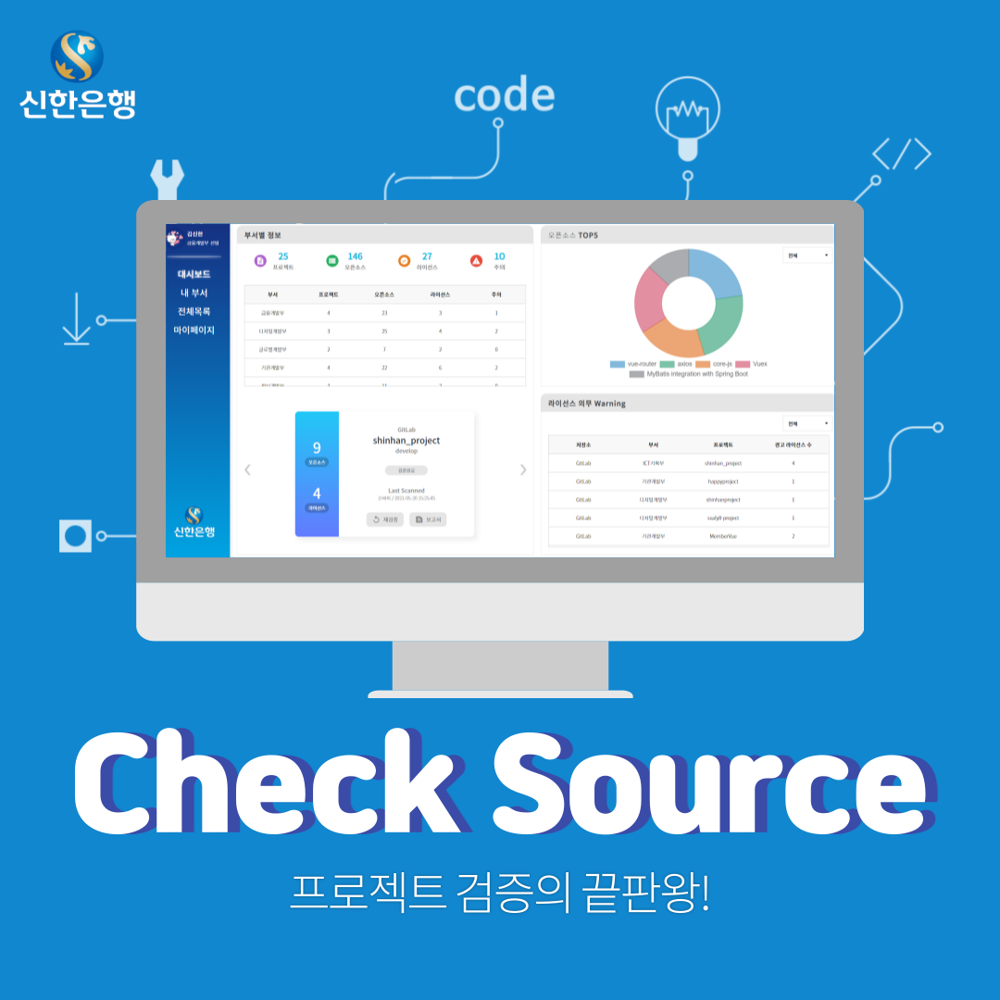
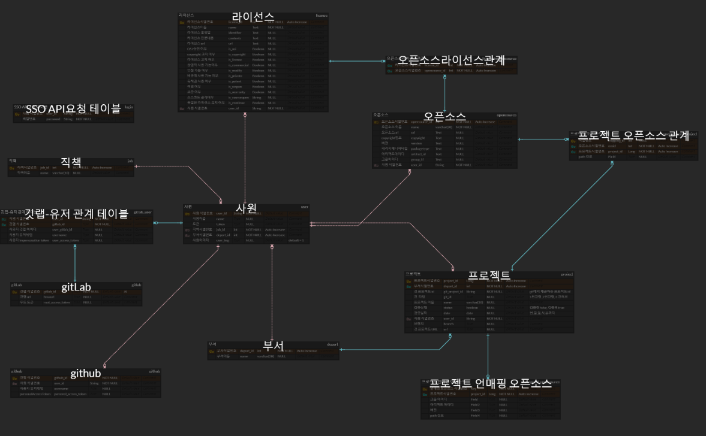
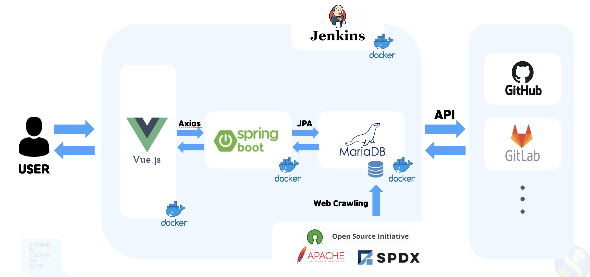
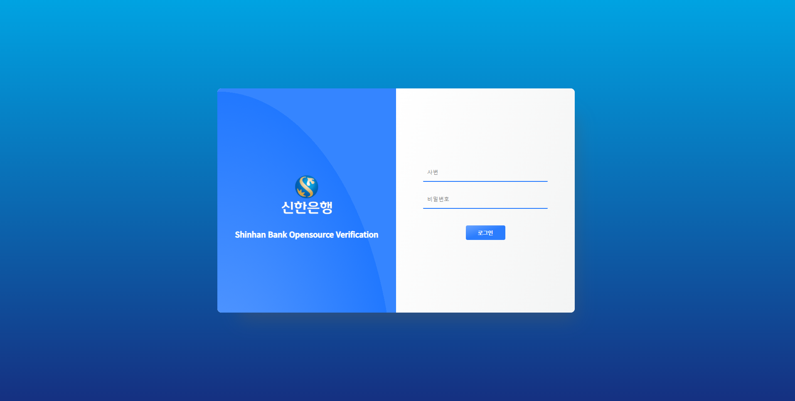
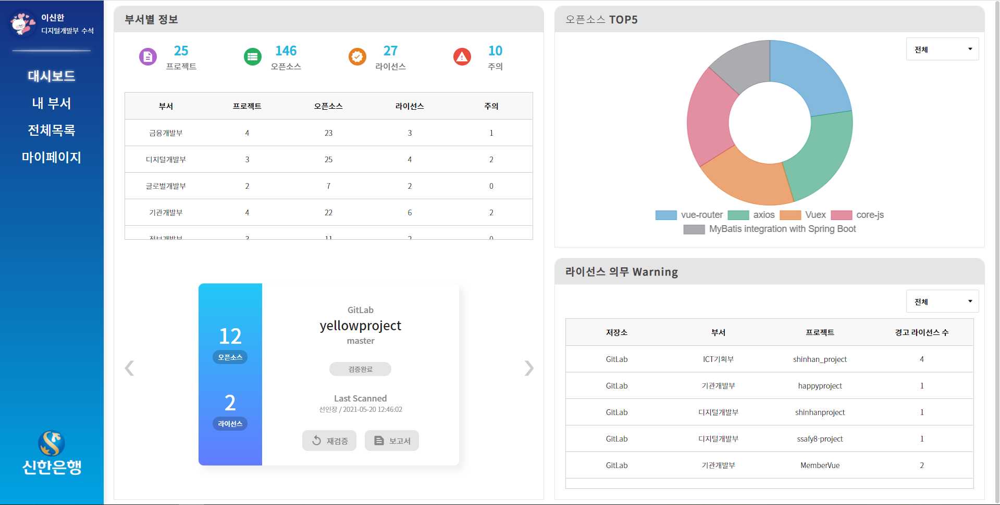
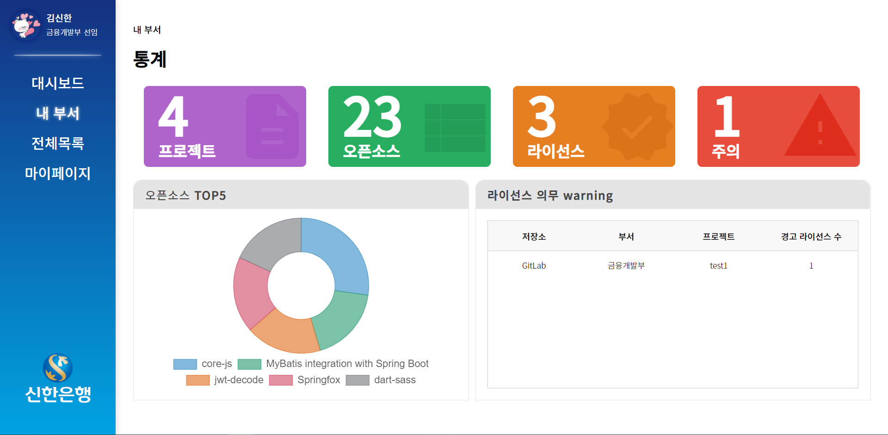
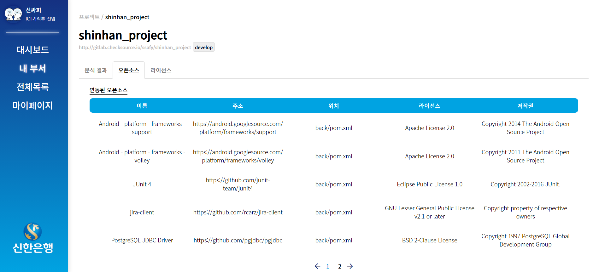
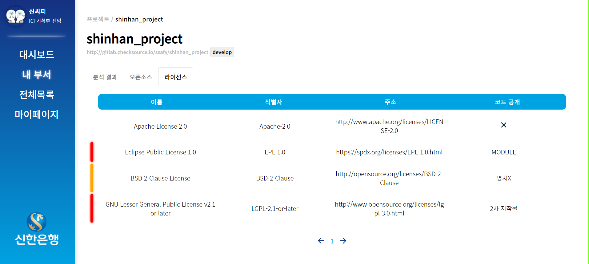
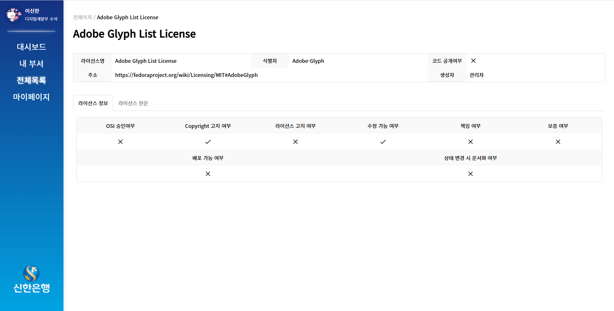

## 🎁 프로젝트 개요

---

- **개발 기간** : 21.04.12 ~ 21.05.28 (총 7주)
- **개발 환경** : Vue.js, Spring Boot, Maria DB, GitLab, JIRA
- **프로젝트 이름** : CheckSource
- **프로젝트 설명 :** 오픈소스 저작권 검증 플랫폼 개발

## **📚기술스택**

---

### **OS**

- Ubuntu : 20.04

### **Frontend**

- Vue.js : 2.6.11

### **Backend**

- Spring Boot: 2.4.5

### **DB**

- MariaDB: 10.2

### **CI/CD**

- Jenkins : 2.290
- docker : 20.10.6

## 🖌ERD (Entity-Relationship Diagram)

---

## 아키텍처

## 화면 UI

[로그인]

[대시보드]

[내 부서 - 통계] 

[내 부서 - 프로젝트]

[검증결과 - 오픈소스]

[검증결과 - 라이선스]

[전체목록 - 라이선스 상세 정보]
