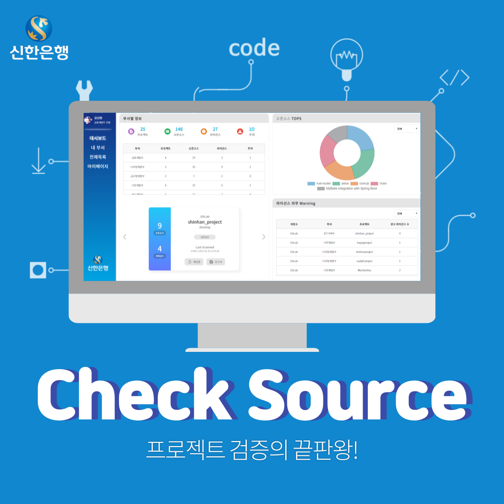
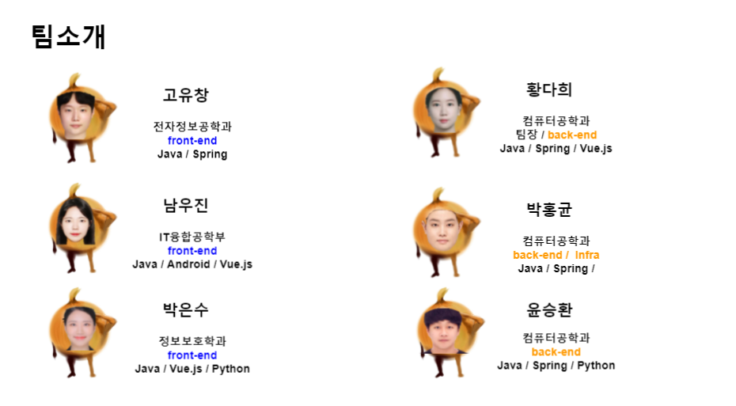

# <strong>Check Source</strong>


## 🎁 프로젝트 개요




- **개발 기간** : 21.04.12 ~ 21.05.21 (6주)
- **개발 환경** : Vue.js, Spring Boot, Maria DB, GitLab, JIRA
- **프로젝트 이름** : CheckSource
- **프로젝트 설명 :** 오픈소스 저작권 검증 플랫폼 개발
- **사이트 링크**
    - **frontend** - [http://checksource.io](http://checksource.io/)
    - **backend** - [http://checksource.io:8080/swagger-ui.html#/](http://52.79.151.0:8080/swagger-ui.html#/)
    - **깃랩 1** - [http://gitlab.checksource.io:8081/](http://gitlab.checksource.io:8081/)
    - **깃랩 2** - [http://gitlab.checksource.io:8082/](http://gitlab.checksource.io:8081/)

## 👩 Team 눈앞에 양파



- <strong>황다희</strong>
    - [ekgml3765@naver.com](mailto:ekgml3765@naver.com)
    - [https://github.com/ekgml3765](https://github.com/ekgml3765)
    - 역할 - backend
- <strong>남우진</strong>
    - [nam990304@gmail.com](mailto:nam990304@gmail.com)
    - [https://github.com/NamWoojin](https://github.com/NamWoojin)
    - 역할 - frontend
- <strong>박은수</strong>
    - [pesu1027@gmail.com](mailto:pesu1027@gmail.com)
    - [https://github.com/eunsu27](https://github.com/eunsu27)
    - 역할 - frontend
- <strong>윤승환</strong>
    - [developeryunsh@gmail.com](mailto:developeryunsh@gmail.com)
    - [https://github.com/lovelyunsh](https://github.com/lovelyunsh)
    - 역할 - backend
- <strong>박홍균</strong>
    - [phk2246@gmail.com](mailto:phk2246@gmail.com)
    - 역할 - backend
- <strong>고유창</strong>
    - [koyc95@gmail.com](mailto:koyc95@gmail.com)
    - [https://github.com/go95305](https://github.com/go95305)
    - 역할 - frontend

## 🛠️ FrontEnd 환경 세팅

### 1. Backend 서버 접근 설정 변경

```
// .\exec\frontend\api\http.js

// 기존 backend 서버 접근에서
const instance = axios.create({
	baseURL: "http://checksource.io:8080",
});

//아래와 같이 변경
const instance = axios.create({
	baseURL: "http://localhost:8080",
});
```

### 2. Vue.js 실행

```
cd .\exec\frontend  //frontend 폴더 접근
npm install         //프로젝트에 요구되는 패키지 설치
npm run serve       //프로젝트 실행
```

## 🛠️ BackEnd 환경 세팅


### 1. Data Base 세팅

- Maria DB 설치
- port : 3306

### 2. Spring Boot 세팅

```
#IDE **세팅**
Workspace .\exec\backend      //workspace 설정
해당 IDE에서 checksource 프로젝트 import
sts에서 실행할 경우, 자체적으로 lombok 설치 후 import 시킬 것
```

```
**#db서버 변경시**
.\exec\backend\checksource\src\main\resources\application.yml
spring:
	datasource:
		url: 연결할 DB url
		(ex. jdbc:mariadb://localhost:3306/checksource?useUnicode=yes&characterEncoding=UTF-8&serverTimezone=Asia/Seoul)
		username: 설정했을시 수정
		password: 설정했을시 수정

// db를 설치한 서버의 IP:port 적거나 로컬에서 테스트할 경우 localhost
```

### 3. Spring Boot 실행

```
#**Spring boot 서버 실행**
// gradle update
// 실행
// JPA 실행하면 DB 스키마 및 엔터티 자동 세팅
```

### 4. DataBase dump파일 실행

```
**# 데이터베이스 초기 데이터 insert**
exec\database\dump.sql 
// 해당 위치의 DB dump 파일을 실행시켜 insert 
```

## **📚기술스택**

### **OS**

- Ubuntu : 20.04

### **Frontend**

- Vue.js : 2.6.11

### **Backend**

- Spring Boot: 2.4.5

### **DB**

- MariaDB: 10.2

### **CI/CD**

- Jenkins : 2.290
- docker : 20.10.6

## 🎈 주요기능

### 분석 / 검증

- 검증할 프로젝트 선택
    - GitLab, GitHub 등 해당 연동된 계정의 repository 목록을 불러와 검증하고 싶은 프로젝트 선택
- 검증한 프로젝트 목록/검색
    - 부서별 검증한 프로젝트의 전체목록 조회 및 검색
- 검증한 프로젝트 보고서
    - 분석결과 탭
        - 검증한 프로젝트의 검증된 오픈소스 수, 연결이 필요한 오픈소스 수, 검증된 라이선스 수,  주의가 필요한 라이선스 수 요약정보 확인
    - 오픈소스 탭
        - 검증한 프로젝트의 연동된 오픈소스, 연동되지 않은 오픈소스 목록 확인
        - 연동되지 않은 오픈소스 추가
    - 라이선스 탭
        - 검증한 프로젝트의 검증된 라이선스 목록 확인

### 대시보드

- 부서별 정보
    - 전체 부서의 검증한 프로젝트 수, 검증한 오픈소스 종류 개수, 검증한 라이선스 종류 개수, 검증한 프로젝트의 warning 개수 조회
- 오픈소스 TOP5
    - 전체 부서의 검증한 프로젝트 중, 가장 많이 사용한 오픈소스 TOP 5 조회
- 라이선스 의무 Warning
    - 전체 부서의 검증한 프로젝트 중, 부서별 프로젝트의 경고 라이선스 수와 함께 주의해야할 프로젝트 목록 조회

### 내 부서 통계

- 통계 정보
    - 내 부서의 검증한 프로젝트 수, 검증한 오픈소스 종류 개수, 검증한 라이선스 종류 개수, 검증한 프로젝트의 warning 개수 조회
- 오픈소스 TOP5
    - 내 부서의 검증한 프로젝트 중, 가장 많이 사용한 오픈소스 TOP 5 조회
- 라이선스 의무 Warning
    - 내 부서의 검증한 프로젝트 중, 부서별 프로젝트의 경고 라이선스 수와 함께 주의해야할 프로젝트 목록 조회

### 오픈소스

- 오픈소스 목록/검색
    - 데이터베이스에 수집되어 있는 오픈소스 정보 조회
    - 라이선스와 오픈소스 명으로 검색
- 오픈소스 상세정보
    - 목록에서 선택한 오픈소스의 오픈소스명, 라이선스, Copyright, url주소, Dependency 정보 조회

### 라이선스

- 라이선스 목록/검색
    - 데이터베이스에 수집되어 있는 라이선스 정보 조회
    - 라이선스명과 식별자명으로 검색
- 라이선스 상세보기
    - 목록에서 선택한 라이선스의 라이선스명, 식별자, 코드공개여부, url주소, 라이선스 전문, 의무사항 정리표 조회

### 마이페이지

- 프로필
    - 기본정보 수정
        - 이름, 부서, 직급, 프로필 아이콘 수정 가능
- 형상관리
    - 검증에 사용될 GitLab, GitHub 계정 연동, 해제


## 🏆 프로젝트 산출물

- [Check Source 문서정리](https://www.notion.so/f60d090cba784f32a66ecdbf289f65f9)
- [Backend 기능명세서](https://docs.google.com/spreadsheets/d/11KNxKlUoQtLbTplsuT1WPCbLQ96ZR96KuIsGtDj7Ilw/edit?usp=sharing)
- [ERD](https://drive.google.com/file/d/1C0tlvul8g19nobMH9tSm2jotK9yx_CBa/view?usp=sharing)
- [Frontend 기능명세서](https://docs.google.com/spreadsheets/d/1gch-bEHKeZvm0v83CO2WlWjSOU7FjEwFJtDxWLeF6Oc/edit#gid=1830621374)
- [와이어프레임](https://drive.google.com/file/d/1wuUlLT1yP3oWWK94v7109wLCLmOcXR_Q/view)
- [UCC](https://www.youtube.com/watch?v=pTuPUViS3sU)
- [최종발표 PPT](https://drive.google.com/file/d/1UeYpgywgYOsJW2UWtvU53h2vwDtWUaYr/view?usp=sharing)
- [페이지 소개](https://www.notion.so/6b942c0956a34cb286d2da537b15eb53)